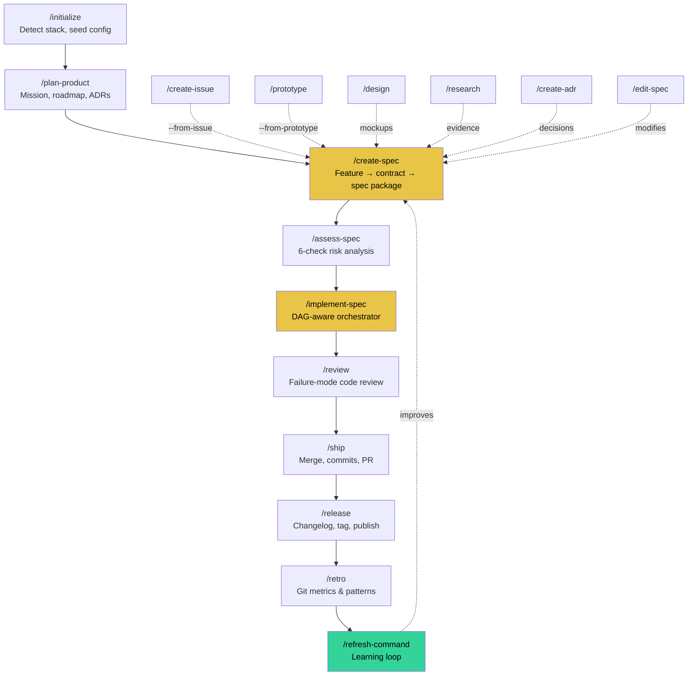
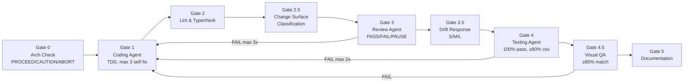

# Code Explanation: Writ Pipeline Architecture

_Generated on 2026-03-20_

## Overview

Writ is a **prompt-driven software methodology** — not a runtime, not a framework, not a CLI. It's a suite of 22 markdown command specifications and 7 agent role definitions that turn an AI coding assistant into a disciplined development team. Every command is a contract: a set of instructions that the AI executes as a structured workflow with quality gates, handoffs, and feedback loops.

The entire "product" is markdown files. The entire "runtime" is an AI model following those files. This is simultaneously its greatest strength (zero dependencies, infinitely portable across Cursor, Claude Code, OpenClaw) and its most interesting constraint (quality depends entirely on specification clarity and model instruction-following fidelity).

## Execution Flow

### The Macro Pipeline

A feature flows through these stages, each a separate command invocation:



### The Per-Story Pipeline (Inside /implement-story)

Each user story passes through up to 8 gates:



### Agents and Their Roles

| Agent | Gate | Mode | Iteration Cap | Pass Criteria |
|-------|------|------|---------------|---------------|
| Architecture Check | 0 | readonly, fast model | 1 | PROCEED / CAUTION / ABORT |
| Coding Agent | 1 | read-write | 3 self-fix | Tests pass, typecheck clean |
| Review Agent | 3 | readonly | 3 iterations | PASS / FAIL / PAUSE |
| Testing Agent | 4 | read-write | 2 fix iterations | 100% pass, ≥80% coverage |
| Visual QA | 4.5 | readonly | shared 3 cap | ≥85% mockup match |
| Documentation | 5 | read-write | 1 | DOCS_UPDATED: YES/NO |
| User Story Generator | create-spec | fast model | 1 per story | Parallel story generation |

## Detailed Breakdown

### Key Design Patterns

#### Contract-First Everywhere
No files created until a contract is locked. `/create-spec`, `/plan-product`, `/edit-spec`, `/new-command` all follow this. Discovery happens in Plan Mode (open-ended). Decisions happen via AskQuestion (bounded). Codified in **ADR-001**.

#### Adaptive Ceremony
`/prototype` for quick changes (no spec). `--quick` flag skips arch-check, review, docs. Full pipeline for serious features. Scope escalation auto-detects when a prototype outgrows its bounds (`--from-prototype`).

#### Self-Correction at Three Levels
- **Agent-level:** Coding/Testing agents self-fix up to 3 iterations before escalating
- **Spec-level:** Drift detection (Small/Medium/Large) with auto-amend for spec-lite, human decision for large drift
- **System-level:** `/refresh-command` mines transcripts for friction signals and proposes command improvements with a promotion pipeline

#### Context Management
`.writ/context.md` regenerated (never patched) after each story. `/assess-spec` estimates context accumulation cost. `spec-lite.md` exists specifically as a compact context payload for agents.

#### Separation of Concerns
`/verify-spec` owns metadata correctness. `/review` owns code quality. `/release` owns the gate. `/assess-spec` owns pre-build risk. No single command tries to do everything.

### Command Categories

**Planning (5):** `/initialize`, `/plan-product`, `/create-spec`, `/edit-spec`, `/design`

**Risk & Analysis (3):** `/assess-spec`, `/research`, `/create-adr`

**Implementation (4):** `/implement-spec`, `/implement-story` (internal), `/prototype`, `/refactor`

**Quality (2):** `/verify-spec`, `/review`

**Shipping (2):** `/ship`, `/release`

**Feedback (3):** `/retro`, `/refresh-command`, `/status`

**Utility (3):** `/create-issue`, `/new-command`, `/explain-code`

## Architecture Context

### File Organization

```
writ/
├── commands/           # Product source — 22 command specifications
├── agents/             # Product source — 7 agent role definitions
├── adapters/           # Platform adapters (Cursor, Claude Code, OpenClaw)
├── cursor/             # Cursor-specific rule (writ.mdc)
├── scripts/            # install.sh, update.sh, migrate.sh, unlink.sh
├── system-instructions.md  # Global agent personality & protocol
├── .writ/              # Development workspace (dogfooding)
│   ├── specs/          # 10 spec packages (stories, tech specs, AC)
│   ├── product/        # Mission, roadmap, decisions
│   ├── research/       # Technical research artifacts
│   ├── decision-records/ # ADRs
│   ├── docs/           # Operational documentation
│   ├── issues/         # Issue tracking
│   ├── retros/         # Retrospective snapshots
│   └── state/          # Ephemeral execution state (gitignored)
└── .cursor/            # Active installation (symlinked to product source)
    └── commands/       # Symlinks → commands/
```

### Self-Dogfooding Model

This repo uses Writ to build Writ. `.cursor/commands/` symlinks to `commands/` (product source). Edits to commands are edits to the product. `.writ/` is the development workspace — specs, research, and decisions for building Writ itself.

## Related Components

- [System Instructions](../../system-instructions.md) — Global agent identity and protocol
- [README](../../README.md) — Public documentation and quick start
- [ADR-001](../decision-records/adr-001-askquestion-vs-plan-mode.md) — AskQuestion vs Plan Mode
- [Mission](../product/mission.md) — Product positioning and phases
- [Roadmap](../product/roadmap.md) — Feature timeline

---

_Generated by Writ on 2026-03-20_
