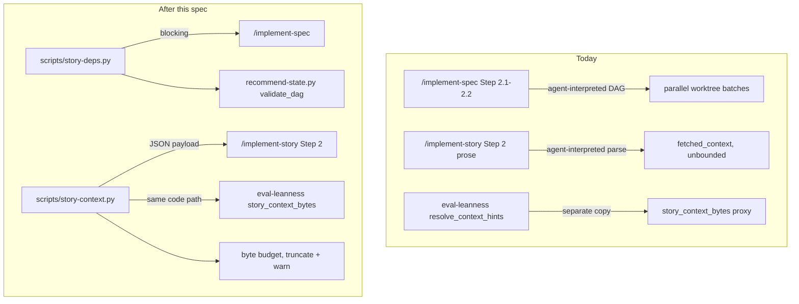

# Technical Spec: Deterministic Story Substrate

> Parent: [`spec.md`](../spec.md)
> Stories: 1 (`story-deps.py`), 2 (`story-context.py`), 3 (budget + measurement), 4 (prose consolidation)

## Architecture



The load-bearing change is that each arrow in the lower graph originates from a single implementation. Today's three copies of the hint contract and two copies of the DAG check become one each.

## Interfaces

### `scripts/story-deps.py`

```
story-deps.py validate --spec-dir <path>
```

`--spec-dir` points at **one** spec folder, deliberately distinct from `spec-deps.py`'s `--specs-dir`, which points at the `.writ/specs/` root. The near-collision is intentional and should not be "corrected" to match.

Exit semantics mirror `spec-deps.py` exactly (lines 50–52, 245–253): success prints a JSON result and exits 0; a contract violation prints a `blocker` envelope and **exits 1**.

```json
{ "schema": "story-graph/v1", "status": "ok", "batches": [["story-1", "story-3"], ["story-2"]], "graph": {} }
```

```json
{ "blocker": { "code": "dependency_cycle", "summary": "story cycle: story-2 -> story-4 -> story-2" } }
```

Reusing `spec-deps.py`'s `ContractError` / `_fail` shape rather than inventing a second convention is the point: a maintainer who has read one blocker reads the other without relearning anything, and Business Rule 3's parity extends to exit codes, not just error-class names.

**The two scripts differ in exit contract, and the difference is the spec's safety rule expressed in code.** `story-deps.py` exits non-zero because an invalid graph must block. `story-context.py` always exits 0 because thin context must degrade. Neither exit contract is arbitrary, and neither should be aligned to the other for the sake of symmetry.

Dependency parsing uses the form proven in `scripts/recommend-state.py` lines 363–366:

```python
re.search(r"(?m)^> \*\*Dependencies:\*\* (.+)$", text)
```

Accepted values: `None` (case-insensitive), `Story N`, comma-separated lists. Batches are topologically ordered with a numeric tie-break so output is reproducible.

### `scripts/story-context.py`

```
story-context.py assemble --story <path> [--budget-bytes N]
```

Always exits 0, even on unresolvable references or a missing source spec — the caller degrades to `spec-lite.md` rather than halting.

```json
{
  "fetched_context": { "error_map_rows": "...", "business_rules": "..." },
  "warnings": ["Context hint references missing content: \"Create session\" in technical-spec.md"],
  "bytes": { "error_map_rows": 812, "business_rules": 431, "total": 1243 },
  "truncated": false
}
```

Category resolution follows `implement-story.md` lines 98–103 exactly:

| Category | Primary source | Fallback |
|---|---|---|
| Error map rows | `technical-spec.md` → Error & Rescue Map rows by Operation name | `spec.md → ## 🎯 Experience Design → ### Error Experience` |
| Shadow paths | `technical-spec.md` → Shadow Paths rows by Flow name | `spec.md → ## 🎯 Experience Design → ### Happy Path` |
| Business rules | `spec.md → ## 📋 Business Rules` matching items | — |
| Experience | `spec.md → ## 🎯 Experience Design` matching subsection | — |

Both reference forms are supported: bracketed (`[item 1, item 2]`) and extended (`file.md → ## Section → ### Subsection`).

## Error & Rescue Map

| Operation | What Can Fail | Planned Handling | Test Strategy |
|---|---|---|---|
| Read story file | File missing or unreadable | `story-deps.py`: treat as missing reference, blocking. `story-context.py`: warn, return empty payload | Fixture with unreadable path |
| Parse `Dependencies` header | Header absent | Treat as `None` — legacy stories are valid, not errors | Fixture story with no header |
| Parse `Dependencies` header | Value unparseable (e.g. `Story ???`) | `malformed_dependencies`, blocking, names story + raw value | Fixture with garbage value |
| Resolve dependency target | Referenced story does not exist | `missing_reference`, blocking, names both stories | Fixture referencing story-9 in a 3-story spec |
| Resolve dependency target | Story depends on itself | `self_reference`, blocking | Fixture `Story 2` in story-2 |
| Resolve dependency target | Same target listed twice | `duplicate_reference`, blocking | Fixture `Story 1, Story 1` |
| Topological sort | Cycle present | `dependency_cycle`, blocking, diagnostic includes full cycle path | Fixtures for 2-story and 4-story cycles |
| Locate hints section | `## Context for Agents` absent | Informational log, empty `fetched_context`, proceed on spec-lite | Legacy fixture story |
| Parse hint category | Prefix typo (`Eror map rows`) | Skip line, warn, continue | Fixture with typo |
| Parse hint category | Malformed brackets (`[a, b`) | Skip category, warn, continue | Fixture with unclosed bracket |
| Parse hint category | Empty brackets `[]` | Skip category silently — valid signal, not an error | Fixture with `[]` |
| Read source spec | `technical-spec.md` absent | Fall through to documented `spec.md` fallback | Fixture spec with no sub-specs dir |
| Read source spec | `spec.md` absent or unreadable | Warn, return empty payload; caller degrades to spec-lite | Fixture with spec.md removed |
| Resolve reference | Named row/rule/section not found | Skip that reference, warn naming reference + file | Fixture referencing a nonexistent row |
| Assemble payload | Total exceeds budget | Truncate lowest-relevance first, set `truncated: true`, warn with actual + budget | Fixture spec with oversized hint targets |
| Invoke assembler from `/implement-story` | Script missing, non-zero exit, or unparseable stdout | Warn, proceed on spec-lite only — never halt the story | Simulated missing script + malformed stdout |
| Invoke validator from `/implement-spec` | Script missing or crashes | Surface the failure and stop before the confirmation gate — an unverifiable graph is not a verified graph | Simulated missing script |
| `eval-leanness` calls assembler | Assembler raises on a malformed story | Contribute 0 bytes, never raise — preserves the existing "unresolvable contributes 0, never an error" contract (`eval-leanness.py` lines 234–237) | Fixture malformed story via leanness harness |
| Baseline update | `scripts/` growth has no justification | ADR-019 ratchet warns; Story 3/4 records the justification | Run `eval.sh --check=leanness` post-change |

Two rows deserve emphasis because they encode the spec's central asymmetry. A **missing assembler degrades** — context gets thinner and the review and testing gates still judge the result. A **missing validator blocks** — an unverified graph must not silently become a verified one, or the gate is theater.

No `[UNPLANNED]` rows remain.

## Shadow Paths

Each cell describes what the **maintainer sees**, not what the code does.

| Flow | Happy Path | Nil Input | Empty Input | Upstream Error |
|---|---|---|---|---|
| Story graph validation | Execution plan shows deterministic batches | No `Dependencies` headers anywhere → all stories in batch 1 | Spec with zero story files → "no stories found", blocking | Script missing → "cannot verify story graph", stops before confirmation |
| Context assembly | Bounded payload, byte report, no warnings | No hints section → `ℹ️ proceeding with spec-lite only` | All categories `[]` → empty payload, no warnings | `spec.md` unreadable → `⚠️ falling back to spec-lite` |
| Budget enforcement | Under budget, silent | No hints → 0 bytes, silent | Empty payload → 0 bytes, silent | Over budget → `⚠️ fetched_context truncated (N of M bytes)` |
| Leanness measurement | `story_context_bytes` matches delivered bytes | No story selected → component reports 0 | Story with no hints → `context_hints: 0` | Malformed story → contributes 0, run still green |

## Interaction Edge Cases

| Edge Case | Planned Handling |
|---|---|
| Validator run twice on the same tree | Byte-identical output — asserted by test, not assumed |
| Story renumbered but dependents not updated | `missing_reference`, blocking, names the dangling target |
| `--from story-N` prunes the graph | Validate the **full** graph first, then prune. A cycle downstream of the entry point is still a cycle |
| Story marked Complete inside a cycle | Still reported — completion does not repair invalid metadata |
| Two stories, mutual dependency | `dependency_cycle` with both stories in the path |
| Hint references content added after the story was written | Resolves normally; no staleness tracking in this spec |
| Same category listed twice in one hints section | Merge references, deduplicate, warn once |
| Unicode section headers (`## 🎯 Experience Design`) | Must resolve — the emoji is part of the real header text in every existing spec |
| Budget exactly at threshold | Not truncated; the comparison is strictly greater-than |
| Concurrent assembler invocations across a parallel batch | Read-only operation, no shared state, no locking needed |

## Verification Strategy

Both scripts are real Python and unit-testable — this spec is not subject to the "markdown methodology has no test suite" constraint that shaped the original format doc.

| Layer | Mechanism |
|---|---|
| Unit | `scripts/tests/test_story_deps.py`, `scripts/tests/test_story_context.py` — ≥80% coverage on new code, 100% on error paths |
| Scenario | `scripts/eval-story-deps.py`, `scripts/eval-story-context.py` emitting PASS/FAIL per the existing `eval-*.py` convention |
| CI | `check_story_deps` and `check_story_context` added to the `CHECKS` array, `scripts/eval.sh` lines 19–47 |
| Static | Existing eval checks assert the command files reference the scripts and retain the routing table |
| Dogfood | Run both across every spec in `.writ/specs/` — 40 real specs are the acceptance corpus, and Story 3's budget derivation depends on it |

Fixtures live under `scripts/tests/fixtures/` following the layout `eval-spec-deps.py` already establishes for synthetic spec trees.
