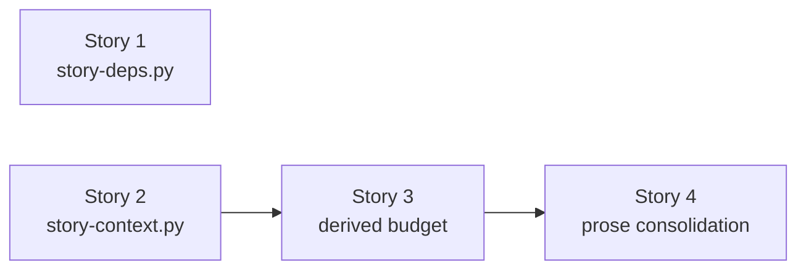

# User Stories: Deterministic Story Substrate

> Parent: [`spec.md`](../spec.md) · Technical: [`sub-specs/technical-spec.md`](../sub-specs/technical-spec.md)
> Progress: 3/4 complete · 21/28 tasks

| Story | Title | Status | Tasks | AC | Priority | Depends on |
|---|---|---|---|---|---|---|
| 1 | [Story Graph Validator with Blocking Pre-Execution Gate](story-1-story-graph-validator.md) | Completed ✅ | 7/7 | 5 | High | None |
| 2 | [Deterministic Context Assembler](story-2-context-assembler.md) | Completed ✅ | 7/7 | 5 | High | None |
| 3 | [Empirically Derived Context Budget and Real Measurement](story-3-derived-context-budget.md) | Completed ✅ | 7/7 | 5 | High | Story 2 |
| 4 | [Consolidate the Orchestrator Prose onto the Assembler](story-4-prose-consolidation.md) | Not Started | 0/7 | 5 | High | Story 3 |

## Dependency Graph

**Batch 1 (parallel):** Story 1, Story 2 — independent
**Batch 2:** Story 3
**Batch 3:** Story 4

## Why the 2 → 3 → 4 chain is sequential, not merged

The chain is not incidental sequencing; each link is a deliberate gate.

**Story 2 before Story 3** — the budget must be derived from measurement across the real spec corpus, and the assembler is the only thing that can produce those measurements. A cap chosen before the distribution exists is a guess, and Business Rule 4 forbids it.

**Story 3 before Story 4** — the prose being deleted in Story 4 is the *running implementation*, not documentation. Story 3 exercises the assembler across all ~40 specs in `.writ/specs/`, which is the evidence that the replacement is equivalent. Deleting the prose first would remove the only working implementation before anything proved the new one matches.

Story 1 shares the eval-wiring and validator conventions with the others but touches disjoint files, so it can land in parallel with Story 2.

## The asymmetry these stories encode

| | Story 1 (`story-deps.py`) | Stories 2–4 (`story-context.py`) |
|---|---|---|
| Failure posture | **Blocks** — invalid graph halts `/implement-spec` | **Degrades** — thin context falls back to `spec-lite.md` |
| Exit contract | Non-zero on violation (`spec-deps.py` shape) | Always 0 |
| Rationale | A wrong graph corrupts parallel worktree execution order | A weaker story is still judged by the review and testing gates |

The exit codes are not a style choice — they are the safety rule expressed in code. See Business Rule 1.
