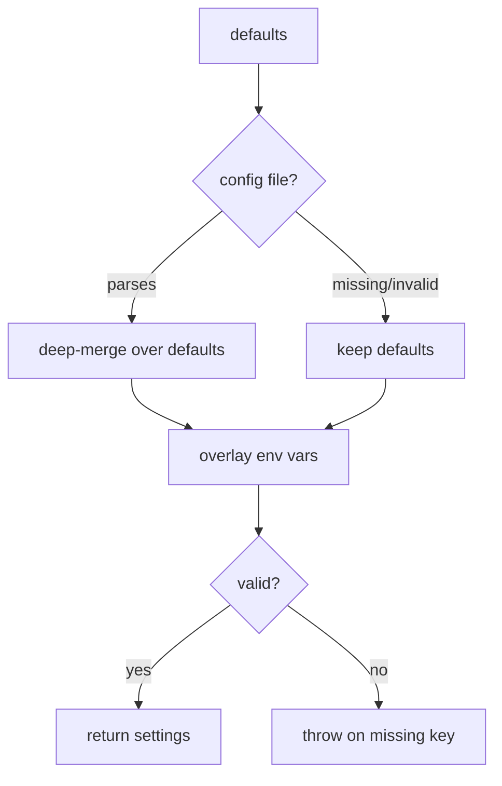

# Code Explanation

## Purpose

Produce a clear, structured explanation of a piece of existing code — a
function, class, file, or line range — that a reader can act on without opening
the source themselves. The explanation is **read-only**: it describes what the
code does and how, never proposing edits, tests, or rewrites. Its defining
quality is that depth scales with the target: a ten-line utility earns three
sentences, a multi-branch state machine earns a full walkthrough and a diagram.

This capability owns *how to explain code well*. The consumer owns *what target
to explain and why* — a research workflow reaching for it to describe a module,
an implementation flow using it to understand an existing pattern before
changing it, or an interactive request where the user names a symbol.

## When to Use

- A reader needs to understand a function, class, file, or line range they did
  not write, and a structured summary is faster than reading the source.
- An investigation surfaces an unfamiliar module whose behavior must be
  described before deciding what to do with it.
- Understanding an existing pattern is a prerequisite to changing it safely.
- The request is explanation only — if the reader wants the code restructured,
  tested, or re-specified, that is a different job and this capability stops at
  the description.

## How to Apply

### 1. Identify and locate the target

If a concrete target is supplied (path, symbol name, or line range), locate it.
If the name is ambiguous and matches several definitions, surface the candidates
and let the reader choose rather than guessing. If no target is named, ask what
to explain before reading anything.

### 2. Read only what the explanation needs

Read the target and the immediate context that makes it legible — no more:

- **The code itself** — the full source of the target.
- **Direct dependencies** — what it imports or calls.
- **Callers** — who uses it and when, found by scanning for references.
- **Types** — the relevant type definitions, interfaces, or schemas.

Do not read the whole codebase. Pull in only the context required to explain the
target accurately; extra reading dilutes focus and burns budget.

### 3. Explain in scaling sections

Every explanation carries the same skeleton, but each section's depth tracks the
target's complexity. Lead with purpose; end only with what earns its place.

- **Purpose** — what the code does, in one or two sentences. This comes first
  because it frames everything else.
- **How It Works** — a walkthrough of the logic. A paragraph suffices for a
  simple function; a numbered breakdown serves a complex flow. Cover input
  handling and validation, the core logic and its decision points, error
  handling and edge cases, and return values and side effects.
- **Context** — where the code sits in the system: what calls it and when, what
  it depends on, and any design pattern genuinely in use (name a pattern only
  when it is really present, never to sound thorough).
- **Diagrams (conditional)** — include a diagram only when it reveals structure
  prose cannot. A flowchart earns its place for multi-branch decision logic, a
  sequence diagram for a multi-step or multi-service call chain, a class diagram
  for an inheritance hierarchy of three or more classes. Skip diagrams for
  simple functions, CRUD, and linear flows; a diagram that merely restates the
  prose is noise.
- **Complexity Notes (conditional)** — include time/space complexity,
  performance characteristics, or known gotchas only when they matter. Omit this
  section entirely for straightforward code.

### 4. Match the register and stay honest

Speak the codebase's own dialect — React terminology for a component, systems
terminology for a systems routine — and do not over-explain language
fundamentals unless asked. When intent is unclear, say so; when a construct looks
unusual and the reason is not evident, flag the uncertainty rather than inventing
a rationale. Keep the output proportional: scale the words to the input, and
stop when the reader has enough to act.

## Examples

**Simple utility — a three-sentence summary is the whole job:**

```text
Purpose: `slugify(title)` converts a display string into a URL-safe slug.
How It Works: lowercases the input, replaces runs of non-alphanumerics with a
single hyphen, and trims leading/trailing hyphens. Returns the empty string for
input that has no alphanumeric characters.
```

**Multi-branch flow — prose plus a flowchart, because the branching is the point:**

```text
Purpose: `resolveConfig()` merges defaults, a config file, and env overrides
into one settings object, with env winning.

How It Works:
1. Load built-in defaults.
2. If a config file exists and parses, deep-merge it over the defaults; a parse
   error is logged and the file is skipped (defaults survive).
3. Overlay any recognized environment variables last.
4. Validate the merged result; throw on a missing required key.
```



**Uncertain intent — name the doubt instead of fabricating a reason:**

```text
The retry loop caps at five attempts with no backoff. The fixed cap is clear;
why backoff was omitted is not evident from the code and no comment explains it —
worth confirming with the author before relying on the current timing behavior.
```
